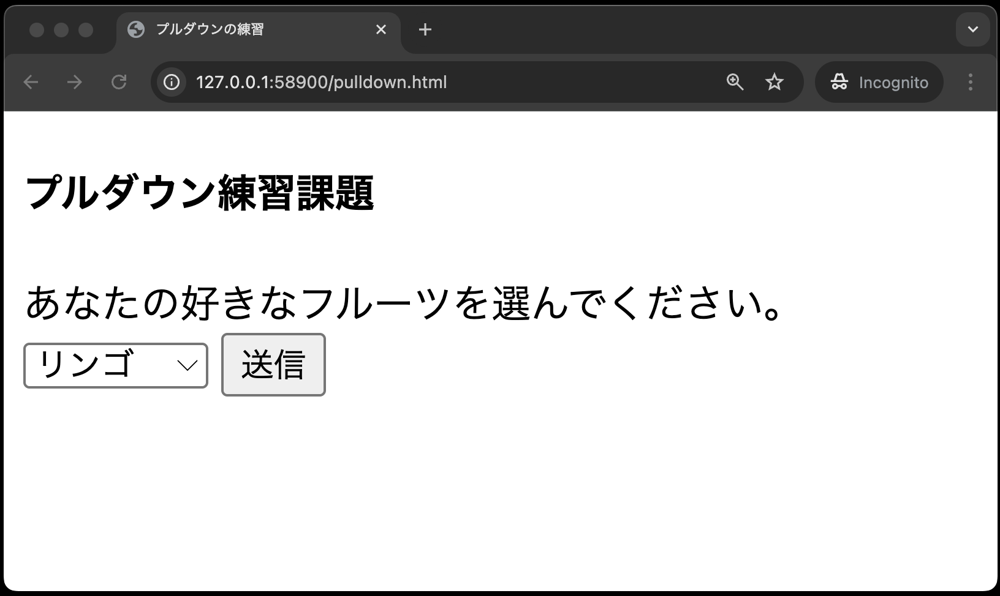

# 課題について

今回の課題では、**授業中では紹介されていない入力フォームを使って**プログラムを作成します。
**各自で調査し、作成してください。**

作成する各ファイルには、それぞれ作成条件が記載されておりますので、そちらには必ず従ってください。**条件を満たしていなければ、GitHub上の自動テストでエラーになります。**

## パスワード

### ◆password.html

- 作成条件
  - フォームの送り先を `password.php` に設定する
  - フォーム要素はそれぞれ改行する
  - 入力フォームとして、以下のものを設定する
    - テキスト「ユーザーID:」として変数`user`に`text`形式
    - テキスト「パスワード:」として変数`pass`に`password`形式
    - 初期値は設定しない
  - 送信ボタンには名前 `submit` を付与する


### ◆password.php

- 作成条件
  - フォームとして受け取った`user`,`pass`の値をそれぞれPHPの命令で出力する
    - 以下の1,2の文章は、それぞれ**別々にpタグでくくる**こと
      1. 「入力されたユーザーIDは、XXXX(`user`の値)です。」
      2. 「入力されたパスワードは、XXXX(`pass`の値)です。」

<br>
※戻るをクリックすると前の画面に戻ります。

## プルダウン

### ◆pulldown.html

- 作成条件
  - フォームの送り先を `pulldown.php` に設定する
  - 入力フォームとして、以下のものを設定する
    - 入力された値は変数名`fruit`に入る
    - 果物(fruit)の候補として、以下の値を挿入すること(順番は気にしないでよい)
      - オレンジ
      - リンゴ
      - メロン
    - 送信ボタンには名前 `submit` を付与する


※ここでは、リンゴを選択しています。

### ◆pulldown.php

- 作成条件
    - フォームとして受け取った`fruit`を出力する
    - 出力するテキストは`p`タグでくくる
    - `p`タグ内のテキストは「あなたの好きなフルーツは、XXX(`fruit`の値)ですね。」とする
  

※戻るをクリックすると前の画面に戻ります。

## テキストエリア

### ◆textarea.html

- 作成条件
  - フォームの送り先を `textarea.php` に設定する
  - 入力フォームとして、以下のものを設定する
    - 横幅(1桁の文字数)50、縦幅(行数)4に設定する
    - 入力テキストの渡される変数名を `input_text` とする
    - 送信ボタンには名前 `submit` を付与する
    - テキストエリアの初期値は設定しない


### ◆textarea.php

- 作成条件
  - 以下の1と2は、それぞれ**別々にpタグでくくる**こと
    1. `入力された文章はつぎのとおりです。`という文章
    2. フォームとして受け取った`input_text`の値


※戻るをクリックすると前の画面に戻ります。

## 採点について

提出した課題がGitHub上で自動採点されます。
pushした課題が合格したかはpush後に必ず確認してください。

### ◆課題の合格基準について

- ３つの入力フォーム(password, pulldown, textarea)について、POSTメソッドでデータ送信がブラウザで確認できること
- 各作成条件に従い、コーディングできていること

### ◆合格確認方法

1. [本章リモートリポジトリ](https://classroom.github.com/a/LVQv1Bpr)にアクセス<br>
2. 画面上部にある`Actions`をクリック<br>
   {: style="width: 660px;height: auto;" }
3. **一番上**の行のタイトル横に、緑色のチェックが入っていればOK<br>
   {: style="width: 660px;height: auto;" }

```note
## エラーが出た時の対処法

自動採点がエラーになると、タイトルの横に赤いばつ印がでます。
その場合の解決策を以下に示します。

### ◆タイムアウトになっていないかを確認する

タイムアウト自体はGitHubの仕様上防ぎようがありません。
タイムアウトになった場合は、GitHub上で処理を再度処理を実行すると解決できます。

例えば、エラーが出た場合、右端の赤枠で囲まれている箇所に処理時間があります。
ここが4分前後かかっている場合は、まずタイムアウトの可能性を疑ってください。


具体的なタイムアウトの確認・解決方法は、

  1. `Actions`のタイトルが下記のようにリンクになっているので、クリック
      
  2. `Arun-autograding-tests.png`をクリック
      
  3. 赤いばつ印が出ている行をクリックし、開く
      
  4. `Operation timed out after 180000 milliseconds with 0 bytes received`のメッセージがあればタイムアウト
      
  5. 解決策としては、右上に`Re-run jobs`(再実行)のボタンがあるので、`Re-run failed jobs`(失敗した処理だけ再実行)をクリックしてください。
      <br>
      
  6. タイムアウトにならず処理が終了したらOK。また、タイムアウトになった場合は、同じことを繰り返す。※タイムアウトでないエラーは、次の解決策を参照。

### ◆プログラムが正確に書かれているか確認する

プログラムが正確に書かれているかを確認してください。
たとえ、ブラウザの画面でそれっぽく表示されても、正しい構文でなければ自動採点ではエラーとなります。
エラーが出た際は、以下の点を確認してください。

  1. `Hello,PHP`の大文字と小文字が正しく書けているか
  2. `Hello,PHP`の前後、間にスペースが入っていないか
  3.  HTMLのタグが正しく書けているか
    ※特に`Hello,PHP`前後の、**<p>タグ**を確認してください。自動採点では、**<p>タグ**で囲まれた文字列を判定材料としています。

### ◆どの入力フォームでエラーがでているか確認する

今回は3つの入力フォーム(password, pulldown, textarea)それぞれのテストがあるので、以下の手順で、どの入力フォームがエラーか確認してください。
※ただし、GitHub上でのエラーメッセージでは、原因の特定が難しい場合もあるので、その場合は適宜質問してください。

1. `Actions`のタイトルが以下のようにリンクになっているので、クリック
  　
2. `run-autograding-tests.png`をクリック
   
3. 以下のような3種類のテストの存在が確認できる
   - `TestPassword.py`: passwordに関するテスト
   - `TestPulldown.py`: pulldownに関するテスト
   - `TestTextarea.py`: textareaに関するテスト
   
4. 各テストエラーがあった場合、それぞれのテストでFAILEDと表示される。以下は、`TestPassword.py`(passwordに関するテスト)でエラーが出ている場合の表示例
   
```
