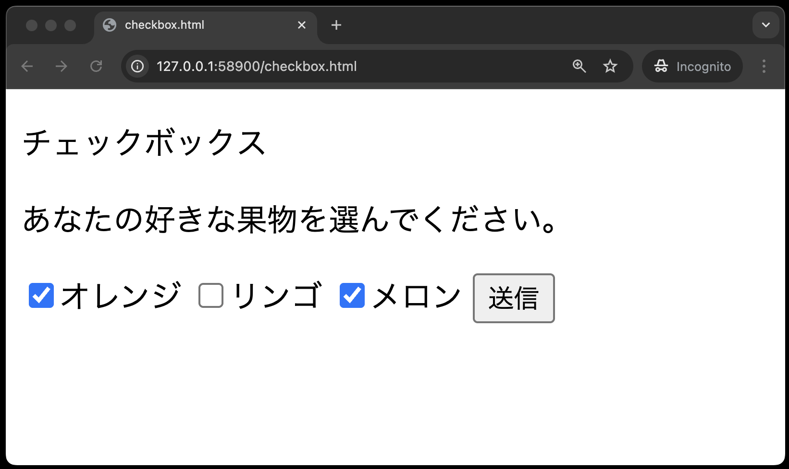
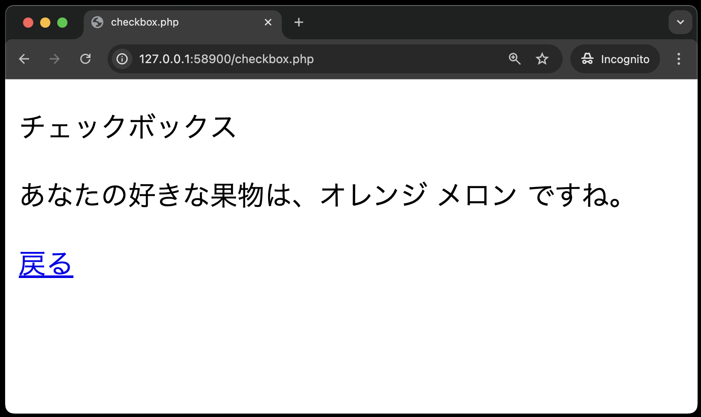

# 入力フォーム - チェックボックス

**checkbox.html**

以下は「オレンジ」と「メロン」を選択している状態です。



**checkbox.php**



**checkbox.html**

```php
<!DOCTYPE html>
<html lang="ja">

<head>
    <meta charset="UTF-8">
    <meta name="viewport" content="width=device-width, initial-scale=1.0">
    <title>checkbox.html</title>
</head>

<body>
    <p>チェックボックス</p>
    <p>あなたの好きな果物を選んでください。</p>
    <form method="POST" action="checkbox.php">
        <input type="checkbox" name="fruits[ ]" value="オレンジ">オレンジ
        <input type="checkbox" name="fruits[ ]" value="リンゴ">リンゴ
        <input type="checkbox" name="fruits[ ]" value="メロン">メロン
        <input type="submit" value="送信">
    </form>
</body>

</html>
```

**checkbox.php**

```php
<!DOCTYPE html>
<html lang="ja">

<head>
    <meta charset="UTF-8">
    <meta name="viewport" content="width=device-width, initial-scale=1.0">
    <title>checkbox.php</title>
</head>

<body>
    <p>チェックボックス</p>
    <?php
    echo '<p>あなたの好きな果物は、';
    foreach ($_POST['fruits']  as  $fruit) {
        echo $fruit . ' ';
    }
    echo 'ですね。</p>';
    ?>
    <a href='checkbox.html'>戻る</a>
</body>

</html>
```

**【解説】**

`$fruit` の後ろに  `.`(ドット)があり、その後ろの `' '` は半角スペースをシングルクォーテーションで囲んでいるので、入力に注意するしてください。
（半角スペースを追記しているのは、複数選択された場合、くだものの名前と名前の間に空白を入れるためです。）