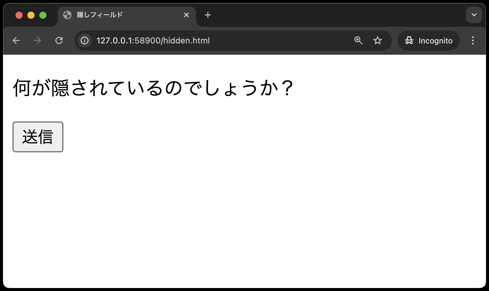
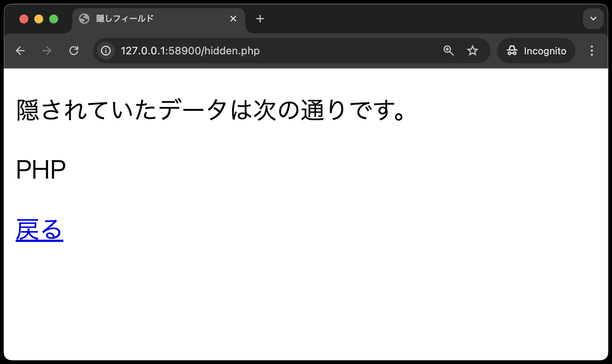
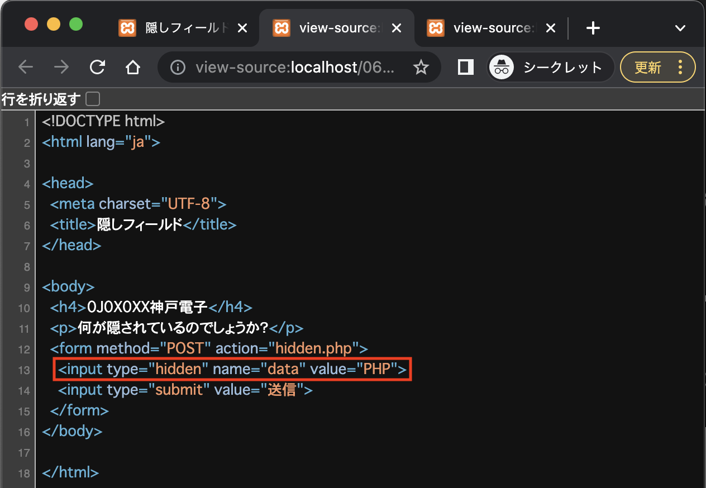

# 入力フォーム - 隠しフィールド(hidden(ヒドゥン))

**hidden.html**



**hidden.php**

※パラメータ=data、値=PHP でデータが送られてくるので、`$_POST['data']`で値を受け取ることができる。<br>



**hidden.html**

```php
<!DOCTYPE html>
<html lang="ja">

<head>
    <meta charset="UTF-8">
    <meta name="viewport" content="width=device-width, initial-scale=1.0">
    <title>隠しフィールド</title>
</head>

<body>
    <p>何が隠されているのでしょうか？</p>
    <form method="POST" action="hidden.php">
        <input type="hidden" name="data" value="PHP">
        <input type="submit" value="送信">
    </form>
</body>

</html>
```

**hidden.php**

```php
<!DOCTYPE html>
<html lang="ja">

<head>
  <meta charset="UTF-8">
    <meta name="viewport" content="width=device-width, initial-scale=1.0">
  <title>隠しフィールド</title>
</head>

<body>
  <p>隠されていたデータは次の通りです。</p>
  <?php
  echo '<p>' . $_POST['data'] . '</p>';
  ?>
  <a href='hidden.html'>戻る</a>
</body>

</html>
```

## 付録: hiddenの詳細

フォームの送信時に、ブラウザに非表示のデータをサーバーに送信することができます。ユーザーには表示されないため、UIの見栄えを損ねずに必要なデータを送信できます。

※作成した`hidden.html`をブラウザに表示し、右クリック→「ソースの表示」でソースコードを確認すると、送信データ(パラメータ=data、値=PHP)が確認できます。<br>



**つまり、ソースコードで見えるということは、本当に大事な情報は扱えないということです。**
