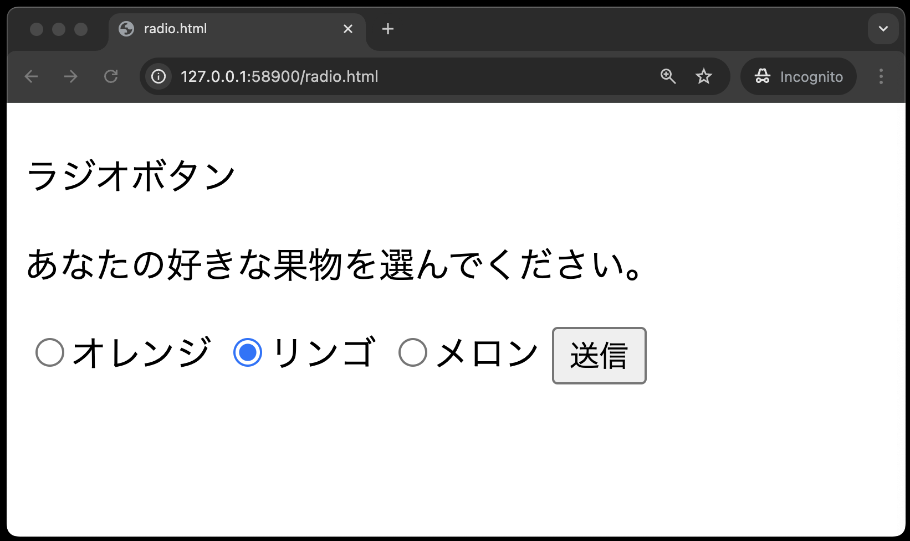
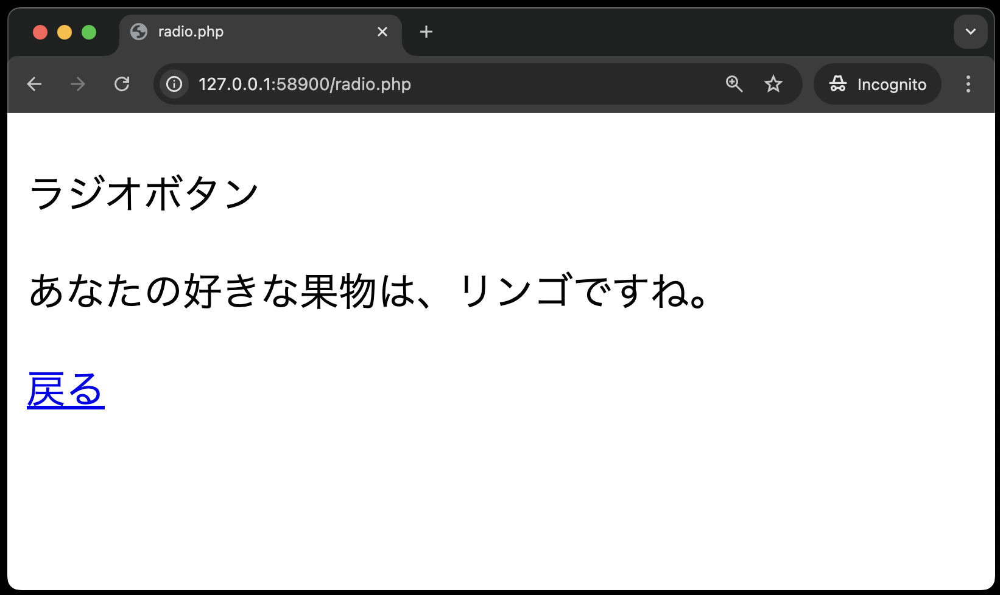
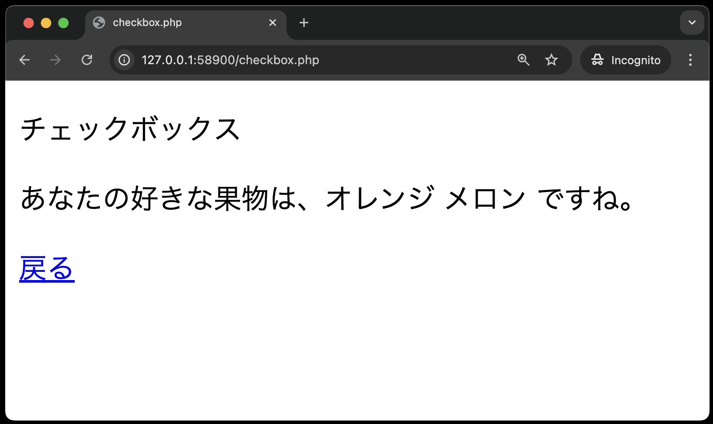
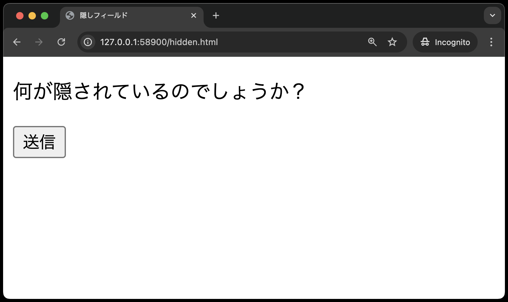
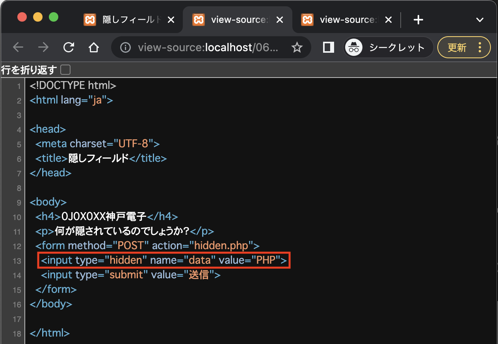

# データ送信(HTTP-POSTメソッド)

[こちらのページ](https://classroom.github.com/a/LNhWo-rk)から、ソースコードを`C:¥web_app_dev`へcloneしてください。

## 付録:PHPの定義済み変数について

ここで紹介するのは、PHPの定義済み変数の一部ですが、本授業で使用するものなので、この機会に知っておきましょう。

`$_GET[ ]`: HTTPのプロトコルGETで現在のスクリプトに渡された変数の連想配列です。クエリストリングスで送られてきたデータを受け取るときに使用します。

`$_POST[ ]`: HTTPのプロトコルPOSTで
現在のスクリプトに渡された変数の連想配列です。入力フォームから送られてきたデータを受け取るときに使用します。

`$_COOKIE[ ]`: クライアントから送られてきたクッキーの連想配列です。 （以降のセクションで取り扱う予定）

`$_SESSION[ ]`: セッションによって保存されたデータにアクセスするための連想配列です。（以降のセクションで取り扱う予定）

`$_SERVER[ ]`: HTTPのどのメソッドでデータが送られてきたかを確認するには `$_SERVER['REQUEST_METHOD']`を利用します。これも連想配列で、値は `GET`、`POST`、`PUT`、`HEAD` などが取得できます。

**使用例**

```PHP
if ($_SERVER['REQUEST_METHOD'] === 'POST') {

    $data = $_POST['パラメータ名'];

} else if ($_SERVER['REQUEST_METHOD'] === 'GET') {

    $data = $_GET['パラメータ名'];

}
```

これを使うことにより、同じパラメータ名だが、時には `GET` で、時には `POST` で送られてくるデータを処理することができます。この授業で「ショッピングサイト」を作成しますが、その時に使う予定です。

# 入力フォーム②

## 事前準備

前回の[入力フォーム①](../http-post-i/README.md)でcloneしたコードをそのまま利用してください。

## POSTメソッドでデータ送信

### ラジオボタン　・・　選択できるのは１つだけ

`public`ディレクトリに、`radio.html`、`radio.php`を作成し、以下のコードを入力してください。

`radio.html`
<br>
※画面を開いた時点で「リンゴ」にチェックが入っている状態にします。

`radio.php`


`radio.html`

```php
<!DOCTYPE html>
<html lang="ja">

<head>
    <meta charset="UTF-8">
    <meta name="viewport" content="width=device-width, initial-scale=1.0">
    <title>radio.html</title>
</head>

<body>
    <h4><!-- ここに"出席番号 名前"を入れてください --></h4>
    <p>ラジオボタン</p>
    <p>あなたの好きな果物を選んでください。</p>
    <form method="POST" action="radio.php">
        <input type="radio" name="fruit" value="オレンジ">オレンジ
        <input type="radio" name="fruit" value="リンゴ" checked>リンゴ
        <input type="radio" name="fruit" value="メロン">メロン
        <input type="submit" value="送信">
    </form>
</body>

</html>
```

`<input>`タグに、`checked`を設定すると、画面を開いたときにそのラジオボタンが選択された状態となります。

`radio.php`

```php
<!DOCTYPE html>

<html lang="ja">

<head>
    <meta charset="UTF-8">
    <meta name="viewport" content="width=device-width, initial-scale=1.0">
    <title>radio.php</title>
</head>

<body>
    <h4><!-- ここに"出席番号 名前"を入れてください --></h4>
    <p>ラジオボタン</p>
    <?php
    echo  '<p>あなたの好きな果物は、'  . $_POST['fruit']  . 'ですね。</p>';
    ?>
    <a href='radio.html'>戻る</a>
</body>

</html>
```

### チェックボックス　・・　複数選択できる

`checkbox.html`


＊上の図は「オレンジ」と「メロン」を選択している状態です。

`checkbox.php`



`checkbox.html`

```php
<!DOCTYPE html>
<html lang="ja">

<head>
    <meta charset="UTF-8">
    <meta name="viewport" content="width=device-width, initial-scale=1.0">
    <title>checkbox.html</title>
</head>

<body>
    <h4><!-- ここに"出席番号 名前"を入れてください --></h4>
    <p>チェックボックス</p>
    <p>あなたの好きな果物を選んでください。</p>
    <form method="POST" action="checkbox.php">
        <input type="checkbox" name="fruits[ ]" value="オレンジ">オレンジ
        <input type="checkbox" name="fruits[ ]" value="リンゴ">リンゴ
        <input type="checkbox" name="fruits[ ]" value="メロン">メロン
        <input type="submit" value="送信">
    </form>
</body>

</html>
```

`checkbox.php`

```php
<!DOCTYPE html>
<html lang="ja">

<head>
    <meta charset="UTF-8">
    <meta name="viewport" content="width=device-width, initial-scale=1.0">
    <title>checkbox.php</title>
</head>

<body>
    <h4><!-- ここに"出席番号 名前"を入れてください --></h4>
    <p>チェックボックス</p>
    <?php
    echo '<p>あなたの好きな果物は、';
    foreach ($_POST['fruits']  as  $fruit) {
        echo $fruit . ' ';
    }
    echo 'ですね。</p>';
    ?>
    <a href='checkbox.html'>戻る</a>
</body>

</html>
```

`$fruit` の後ろに  `.`(ドット)があり、その後ろの `' '` は半角スペースをシングルクォーテーションで囲んでいるので、入力に注意するしてください。（半角スペースを追記しているのは、複数選択された場合、くだものの名前と名前の間に空白を入れるためです。）

## 隠しフィールド（ hidden : ヒドゥン ）

`hidden.html`



`hidden.php`

※パラメータ=data、値=PHP でデータが送られてくるので、`$_POST['data']`で値を受け取ることができる。<br>


`hidden.html`

```php
<!DOCTYPE html>
<html lang="ja">

<head>
    <meta charset="UTF-8">
    <meta name="viewport" content="width=device-width, initial-scale=1.0">
    <title>隠しフィールド</title>
</head>

<body>
    <h4><!-- ここに"出席番号 名前"を入れてください --></h4>
    <p>何が隠されているのでしょうか？</p>
    <form method="POST" action="hidden.php">
        <input type="hidden" name="data" value="PHP">
        <input type="submit" value="送信">
    </form>
</body>

</html>
```

`hidden.php`

```php
<!DOCTYPE html>
<html lang="ja">

<head>
  <meta charset="UTF-8">
    <meta name="viewport" content="width=device-width, initial-scale=1.0">
  <title>隠しフィールド</title>
</head>

<body>
  <h4><!-- ここに"出席番号 名前"を入れてください --></h4>
  <p>隠されていたデータは次の通りです。</p>
  <?php
  echo '<p>' . $_POST['data'] . '</p>';
  ?>
  <a href='hidden.html'>戻る</a>
</body>

</html>
```

## 付録: hiddenの詳細

フォームの送信時に、ブラウザに非表示のデータをサーバーに送信することができます。ユーザーには表示されないため、UIの見栄えを損ねずに必要なデータを送信できます。

※作成した`hidden.html`をブラウザに表示し、右クリック→「ソースの表示」でソースコードを確認すると、送信データ(パラメータ=data、値=PHP)が確認できます。<br>



**つまり、ソースコードで見えるということは、本当に大事な情報は扱えないということです。**

**本章はサンプルコードです。課題提出はございません。入力フォームの課題は後日公開します。**
