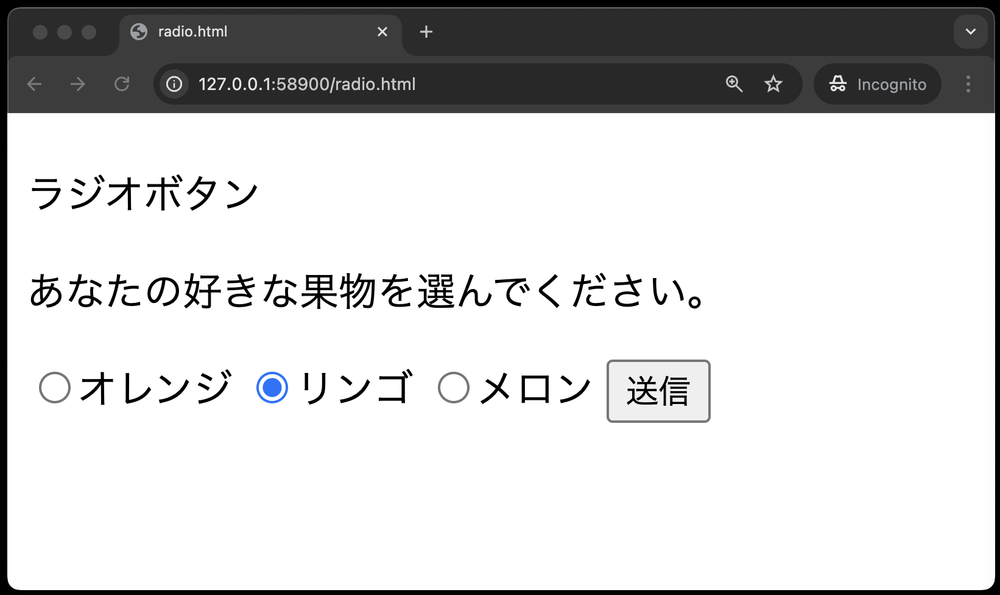
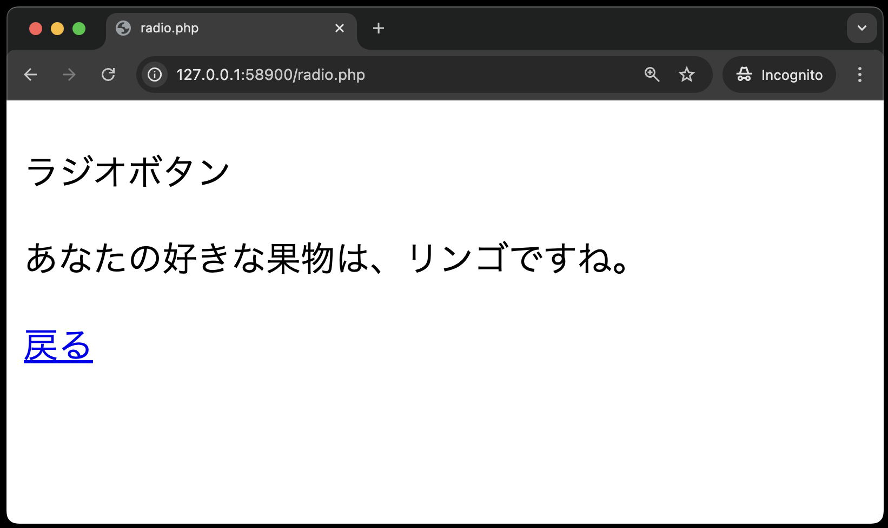

# 入力フォーム - ラジオボタン

`public`ディレクトリに、`radio.html`、`radio.php`を作成し、以下のコードを入力してください。

**radio.html**

※画面を開いた時点で「リンゴ」にチェックが入っている状態にします。
<br>

**radio.php**



**radio.html**

```php
<!DOCTYPE html>
<html lang="ja">

<head>
    <meta charset="UTF-8">
    <meta name="viewport" content="width=device-width, initial-scale=1.0">
    <title>radio.html</title>
</head>

<body>
    <p>ラジオボタン</p>
    <p>あなたの好きな果物を選んでください。</p>
    <form method="POST" action="radio.php">
        <input type="radio" name="fruit" value="オレンジ">オレンジ
        <input type="radio" name="fruit" value="リンゴ" checked>リンゴ
        <input type="radio" name="fruit" value="メロン">メロン
        <input type="submit" value="送信">
    </form>
</body>

</html>
```

**【解説】**

`<input>`タグに、`checked`を設定すると、画面を開いたときにそのラジオボタンが選択された状態となります。

**radio.php**

```php
<!DOCTYPE html>

<html lang="ja">

<head>
    <meta charset="UTF-8">
    <meta name="viewport" content="width=device-width, initial-scale=1.0">
    <title>radio.php</title>
</head>

<body>
    <p>ラジオボタン</p>
    <?php
    echo  '<p>あなたの好きな果物は、'  . $_POST['fruit']  . 'ですね。</p>';
    ?>
    <a href='radio.html'>戻る</a>
</body>

</html>
```
