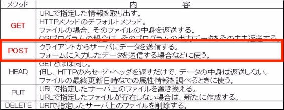
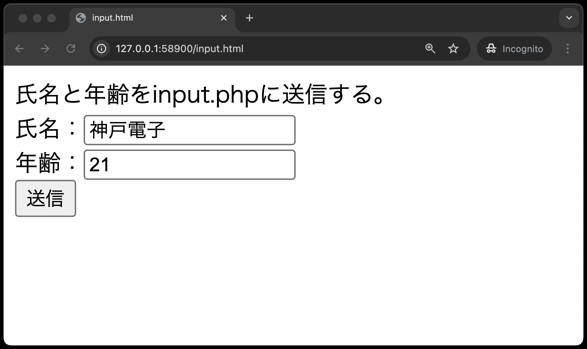
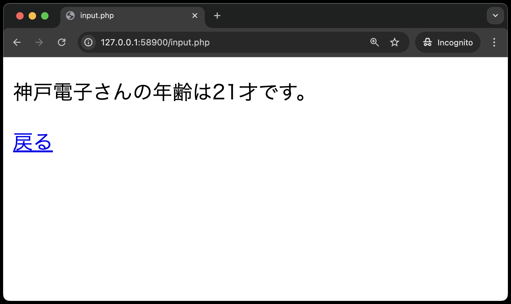

# 本章でのデータ送信について

本章では、様々な種類の**入力フォーム**を使用し、**POSTメソッド**でデータを送信する方法を学びます。



## 入力フォーム - テキストボックス

`public`ディレクトリ直下に`input.html`、`input.php`を作成してください。
ここでは、入力フォームの一種であるテキストボックスを使用し、以下を達成することを目標とします。

- テキストボックスを使用し、`input.html`からPOSTメソッドでデータを送信する
- 送信されたデータをサーバ上の`input.php`で受け取り、クライアントのブラウザに表示する

**input.html**


**input.php**


※POSTメソッドで送信した場合、URL末尾にデータ(クエリパラメータ)は表示されません。

**input.html**

```php
<!DOCTYPE html>
<html lang="ja">

<head>
  <meta charset="UTF-8">
  <meta name="viewport" content="width=device-width, initial-scale=1.0">
  <title>input.html</title>
</head>

<body>
  氏名と年齢をinput.phpに送信する。<br>
  <form method="POST" action="input.php"> <!-- ① -->
    氏名：<input type="text" name="name"><br> <!-- ② -->
    年齢：<input type="text" name="age"><br> <!-- ③ -->
    <input type="submit" value="送信">  <!-- ④ -->
  </form>
</body>

</html>
```

①: 入力したデータを `input.php` にHTTPのプロトコル`POST` を使って送信する。<br>
②: 氏名のテキストボックスに入力された値のパラメータ名（変数名）を`name`とする。<br>
③: 年齢のテキストボックスに入力された値のパラメータ名（変数名）を`age`とする。<br>
④: ボタンに表示する値を「送信」とし、クリックすると10行目の`<form>`タグで定義した方法でデータを送信する。<br>

`input.php`

```php
<!DOCTYPE html>
<html lang="ja">

<head>
    <meta charset="UTF-8">
    <meta name="viewport" content="width=device-width, initial-scale=1.0">
    <title>input.php</title>
</head>

<body>
    <h4><!-- ここに"出席番号 名前"を入れてください --></h4>
    <?php
    echo '<p>' . $_POST['name'] . 'さんの年齢は' . $_POST['age'] . '才です。</p>';
    ?>
    <a href='input.html'>戻る</a>
</body>

</html>
```

※`$_POST['パラメータ名']` で送信されてきたデータを受け取ることができます。この `$_POST[ ]`も、`$_GET[ ]`同様、PHPの定義済み変数の一つで、その実態は連想配列です。